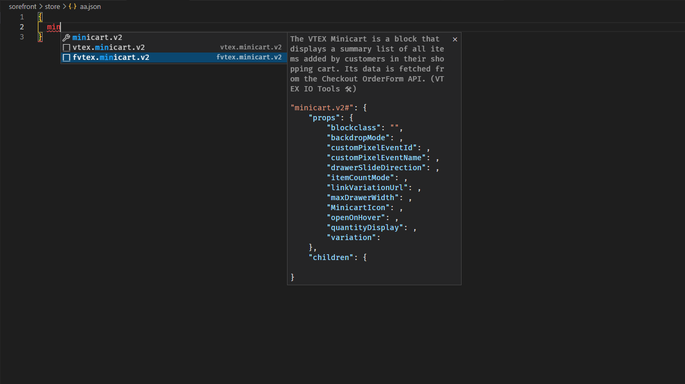
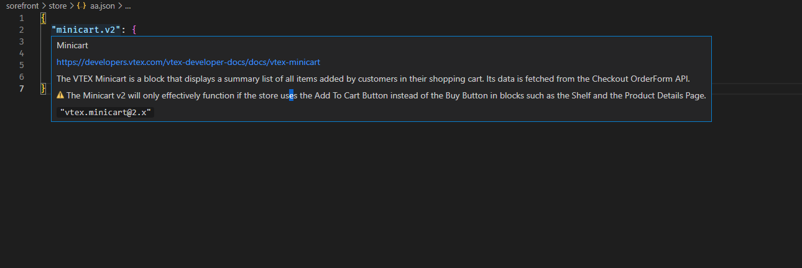

<p align="center">
  <a href="https://marketplace.visualstudio.com/items?itemName=1marlonpassos.vtex-io-tools">
    
  </a>
</p>

<h1 align="center">VTEX IO Tools 🛠</h1>


## Objetivo


- Esse projeto tem como objetivo facilitar o desenvolvimento de projetos com VTEX IO na criação de novos blocos no JSON e estilizaçoes CSS. Esses snippets geram um auto complete inteligente dos blocos da VTEX IO com todas as propriedades disponiveis e seus argumentos validos. 
- Ter atalhos que vão ajudar no desenvolvimento projeto VTEX na estrutura JSON, SCSS e REACT
- Ser um plugin do VSCode

## Caracteristicas 
- snippets
  - CSS
  - JSON
- auto complete inteligente (mesmo em blocos com identificadores)
- Documentação VTEX inbutida 
- Mostra Valores que vem por padrao em cada propriedade
- Verifica erros na escrita dos blocos JSON
  
## Como Instalar 

   [Instale a extensao no marketplace do VSCode ](https://marketplace.visualstudio.com/items?itemName=1marlonpassos.vtex-io-tools)


## Como usar

### Snippets (json)
Dentro de aquivos JSON/JSONC existem 2 tipos de snippets, os com o prefixo ``vtex.``. e os com ``fvtex.``.
- ``fvtex.`` -> Cria um objeto JSON com todas as propriedades do componente VTEX
- ``vtex.`` -> Cria um objeto JSON com as propriedades mais usadas do componente VTEX       

Depois do prefixo escreva o nome do componente VTEX que deseja, exemplo:

``fvtex.rich-text``
```json
{
  "rich-text#": {
    "props": {
      "blockClass": "",
      "font": "",
      "htmlId": "",
      "preventVerticalStretch": ,
      "text": "",
      "textAlignment": "",
      "textColor": "",
      "textPosition": ""
    },
    "children": [
      ""
    }
  }
}
```
``vtex.rich-text``
```json
{
  "rich-text#": {
    "props": {
      "blockClass": "",
      "preventVerticalStretch": ,
      "text": "",
      "textAlignment": "",
    },
    "children": [
      ""
    }
  }
}
```

### Snippets (css)
Dentro de aquivos CSS/SCSS existem 2 tipos de snippets, os com o prefixo ``vtex.`` e os com ``cvtex.``.

- ``vtex.`` -> Cria uma estrutura com todas as classe que esse componte deixa disponivel 
- ``cvtex.`` -> Cria uma estrutura com todas as classe que esse componte deixa disponivel + adiciona cometarios sobre as classes
  
  ``cvtex.flex-layout``
```scss
// Container 
.flexRow-- {

}

// Involucro 
.flexRowContent-- {

}
```
  
``vtex.flex-layout``
```scss
.flexRow-- {

}

.flexRowContent-- {

}
```
💡 Lembre-se de usar o atalho ``CTRL + SPACE`` para ver os snippets disponiveis enquanto digita 


### intellisense 
Como projetos VTEX IO por padrao seguem a mesma estrutura de pastas o intellisense so funcionara dentro de arquivo JSON que estao dentro de uma pasta 

💡 Ao passar o mouse em cima do nome de componente ou propriedade voce vai ver uma descrição



## Progresso 

[Veja como esta o progresso de desenvolvimento dessa extensao](./docs/progresso.md)

## Contribua
[Ajude-nos a melhorar a extensao](./docs/CONTRIBUTING.md), seja com sugestoes, novas features, apontamento de erros ou no proprio desenvolvimento dos blocos que ainda faltam.


## Licença
Licensed under the [MIT license](./LICENSE)

## Agradecimentos