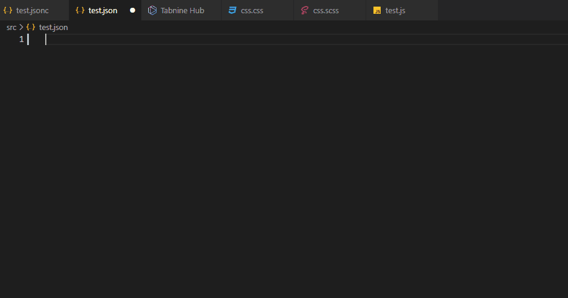

# Objetivo


- Esse projeto tem como objetivo facilitar o desenvolvimento de projetos com VTEX IO na criação de novos blocos no JSON e estilizaçoes CSS. Esses snippets geram um auto complete inteligente dos blocos da VTEX IO com todas as propriedades disponiveis e seus argumentos validos. 
- Ter atalhos que vão ajudar no desenvolvimento projeto VTEX na estrutura JSON, SCSS e REACT
- Ser um plugin do VSCode

# Caracteristicas 
- snippets
  - CSS
  - JSON
- auto complete inteligente
- Documentação VTEX inbutida 
- Mostra Valores que vem por padrao em cada propriedade
- Verifica erros na escrita dos blocos JSON


# Como usar

Todos os snippets começam do ``vtex.``, logo para usalos escreva ``vtex.nomedoblocovtex`` e aperte TAB no autocomplete do VSCode.<br/> Exemplo: Se eu quero os snippets do bloco flex-layout eu vou digitar ``vtex.flex-layout``

Como algumas propriedades geralmente são pouco usadas e o intuito dessa ferramenta é acelerar o desenvolvimento, na verção JSON existem dois tipos de prefixos de  snipets:

- vtex. -> Verção resumida com as propriedades mais usadas
- fvtex. -> Verção completa com todas as propriedades 

Alguns snippets CSS/SCSS devido a grande quantidade de classes existe uma versão com comentarios no topo para facilitar a localização no codigo para os iniciantes. Em vez de usar o prefixo <s>``vtex.``</s> use ``cvtex.``

# Como instalar os snippets 

1. 

# Como contribuir
1. [Baixe a extensao Convert text/code to a snippet](https://marketplace.visualstudio.com/items?itemName=nsfilho.tosnippet). Ela vai ajudar no processo de criação de novos snippets.
2. Escolha em nossa lista de tarefas alguma propriedade faltando que você deseja contribuir.
3. Faça uma fork desse projeto
4. crie uma nova branch
5. Acesse o a documentação da VTEX no bloco que voce escolheu, e cole esse codigo no navegador:
```js
const $tabelas = document.querySelectorAll(".rdmd-table-inner");

for (let $tabela of $tabelas) {

    let propriedadesEstruturadas = "";
    console.log("Tabela:")
    
    const $linhas = Array.from($tabela.querySelectorAll("tbody tr"));
    for (let $linha of $linhas) {
        const $celulas = Array.from($linha.querySelectorAll("td"));
        const [nomeObjeto, tipo, descricao, valorPadrao] = $celulas.map($celula => {
            return $celula.innerText
        })
        const regrasValorPadrao = {
            '""': '""',
            "undefined": "",
            "false": "false",
            "true": "true",
        }
        const vaiTerVirgula = ($linha == $linhas.at(-1)) ? "":","
        const valor = regrasValorPadrao[`${valorPadrao}`]??`"${valorPadrao}"`;
        const linhaEstruturada = `"${nomeObjeto}": ${valor}${vaiTerVirgula}`
        propriedadesEstruturadas += linhaEstruturada + "\n"
        
    }
    console.log(propriedadesEstruturadas)
}

```
Este codigo vai gerar retorna no console um rascunho de todas as propriedades que esse bloco recebe diretas da tabela

6. Com isso monte um template de desse bloco em algum dos arquivos test.* (Deixei esses arquivos para testar tudo sem a necessidade de ficar criando arquivos avulsos)
7. Depois de criar o template ajuste esse codigo para o formato de snippet JSON.<br/> Você pode selecionar o seu codigo, apertar F1 e digitar ``>Convert to Snippet`` e aperte enter, assim retorar no seu terminal uma verção com o espaçamentos e tabulação ajustados.
8. Pedir um Pull Request 